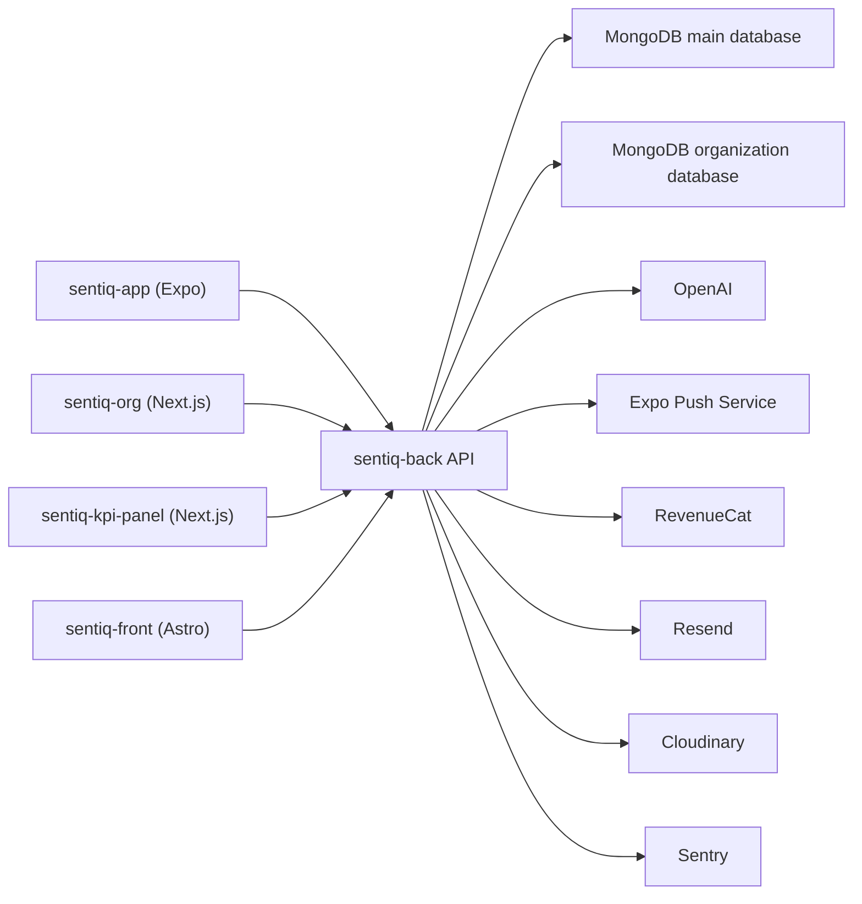

# Sentiq Technical Overview

Version: 1.1

Status: Current implementation

---

# Purpose

This folder documents the technical foundation that exists across the Sentiq workspace.

It is a current-state reference for developers and AI agents. Product strategy belongs in the product, B2C and B2B sections of the Knowledge base.

---

# Repository Systems

Sentiq is composed of five applications that share one backend:

- **sentiq-app** — athlete mobile app (Expo / React Native / TypeScript)
- **sentiq-back** — REST API, Socket.IO server and background jobs (Node.js / Express / JavaScript ESM)
- **sentiq-org/org-web** — organization and super-admin portal (Next.js / TypeScript)
- **sentiq-front** — public marketing and legal site (Astro)
- **sentiq-kpi-panel** — internal founder/admin analytics panel (Next.js / TypeScript)

The backend is currently JavaScript with ES modules, not TypeScript.

---

# Runtime Architecture

Clients never connect directly to MongoDB or OpenAI.

See [architecture.md](./architecture.md).

---

# Deployment

Current repository configuration shows:

- Backend web service on Render (`sentiq-back/render.yaml`)
- Render cron jobs for weekly/monthly Learning Cards and weekly Org briefings
- Mobile builds and submissions through EAS (`sentiq-app/eas.json`)
- Expo Updates configured with app-version runtime policy
- Web clients use environment-configured API base URLs
- MongoDB Atlas operational metrics integrated into the internal panel

Deployment of each web frontend is environment-specific; Vercel integration exists for operational usage and cost metrics.

---

# Authentication And Authorization

- JWT Bearer tokens
- Password hashes stored with bcrypt
- Versioned terms/privacy acceptance gate
- Athlete feature access through plans, per-user overrides and effective entitlements
- Org context via `X-Org-Id` plus Membership role
- Org roles: `player`, `staff`, `coach`, `club_admin`
- Global controls: `isAdmin`, `isSuperAdmin`

Authorization is enforced in backend route middleware. Frontend checks are UX only.

---

# Data

Sentiq uses MongoDB through Mongoose.

There are two logical connections:

- **main database** (`MONGO_URI`): users, athlete data, subscriptions, benefits and operations
- **organization database** (`MONGO_ORG_URI`): organizations, memberships, rosters, teams, invitations, reports, campaigns and org grants

Cross-database references are stored as ObjectIds but cannot rely on standard Mongoose population across connections.

See [database.md](./database.md).

---

# External Services

- **OpenAI** — objectives, reports, preparation and Learning Cards
- **RevenueCat** — native subscription state and webhooks
- **Expo Push Service** — backend push delivery
- **Expo Notifications** — local mobile scheduling and deep links
- **Resend** — transactional and invitation email
- **Cloudinary** — avatars and organization logos
- **Sentry** — backend and mobile error/performance monitoring
- **Render** — backend and cron runtime
- **EAS / Expo Updates** — mobile build, submission and OTA delivery

Integrations are controlled by environment variables and, where applicable, feature flags.

---

# Current Engineering Reality

Strengths:

- Clear product-domain models
- Shared API for athlete, organization and admin clients
- Server-side premium entitlement checks
- Timezone-aware evaluation and notification flows
- Idempotency and unique indexes in commercial flows
- Mobile and backend observability

Known constraints:

- Backend automated test script is not implemented
- Mobile has linting but no repository test script
- Some routes/services are large and mix orchestration with HTTP concerns
- Some jobs run as in-process intervals; horizontal scaling requires deduplication
- IEA and some admin caches are in memory, so they are per-process
- Organization data uses a second MongoDB connection, adding cross-database coordination
- `ProductEvent` is groundwork, not a complete analytics event pipeline

Security, privacy and reliability findings are prioritized in [hardening-backlog.md](./hardening-backlog.md). Items in that document are audit findings, not completed work.

---

# Technical Principles

1. Server-side authorization is the source of truth.
2. Store local-day and timezone context for event-based athlete data.
3. Make retries idempotent for grants, campaigns, webhooks and scheduled reports.
4. Prefer domain services over business logic duplicated across clients.
5. Feature flags control rollout, not authorization.
6. Keep secrets in runtime configuration; never in mobile bundles or documentation.
7. Optimize only after product and operational evidence.

---

# Documents

- [architecture.md](./architecture.md)
- [backend.md](./backend.md)
- [database.md](./database.md)
- [mobile.md](./mobile.md)
- [hardening-backlog.md](./hardening-backlog.md)

Related product behavior:

- [../03-product/README.md](../03-product/README.md)
- [../03-product/notifications.md](../03-product/notifications.md)
- [../03-product/premium.md](../03-product/premium.md)
- [../05-b2b/sentiq-org.md](../05-b2b/sentiq-org.md)

---

# Final Principle

Sentiq technology should remain invisible to users while protecting their data and reliably supporting the athlete development journey.
