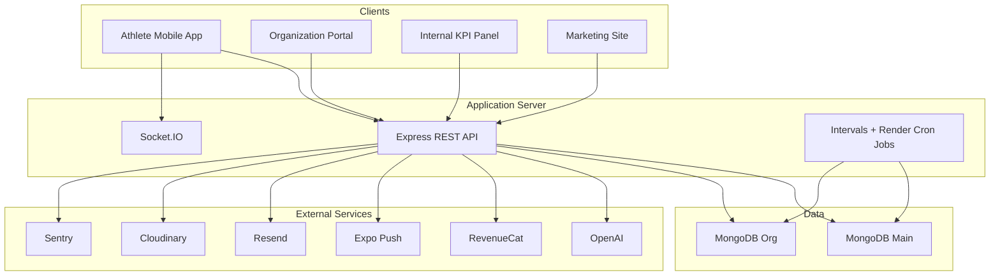
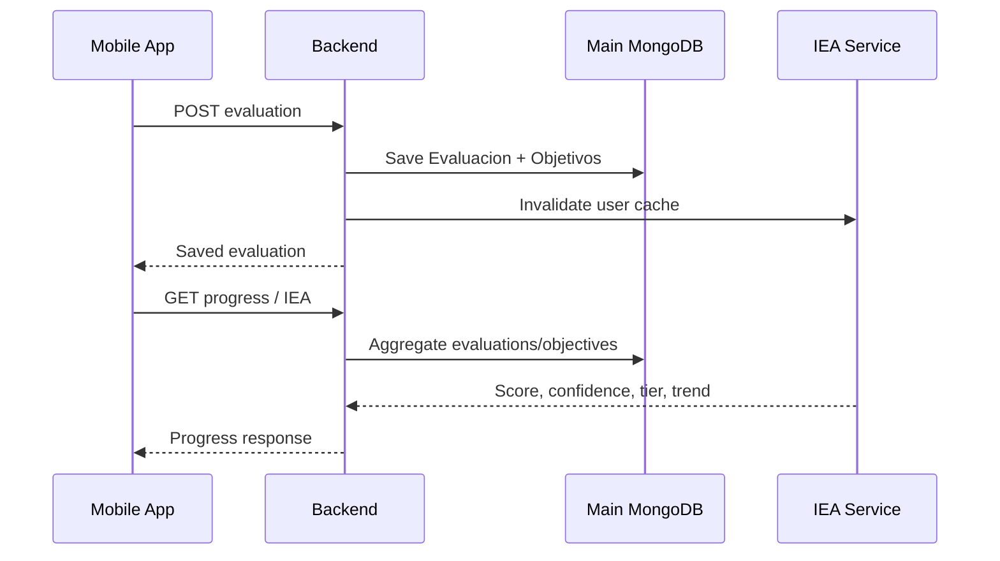

# Sentiq System Architecture

Version: 1.0

Status: Current implementation

---

# Purpose

This document describes how Sentiq applications, backend services, databases and external integrations work together.

---

# System Context

Sentiq is a multi-client platform with one central Node.js backend.

---

# Application Boundaries

## sentiq-app

Athlete-facing native application.

Responsibilities:

- Authentication, legal acceptance and onboarding
- Evaluations and objectives
- Meta Foco, Progress/IEA and Coach Sentiq outputs
- Red follower network
- Local notifications and push response handling
- RevenueCat native purchase UI

It uses Expo Router and communicates with the backend through Axios.

## sentiq-back

Central server-side source of truth.

Responsibilities:

- Authentication and authorization
- Athlete and organization business rules
- MongoDB persistence
- AI orchestration
- Subscription and benefit resolution
- Notifications, email and media integrations
- Admin analytics
- Scheduled generation and maintenance jobs

## sentiq-org/org-web

Next.js portal for coaches, staff, club admins and global super-admin operations.

It sends JWT Bearer tokens and the selected organization in `X-Org-Id`.

## sentiq-kpi-panel

Internal Next.js admin client.

It consumes `/api/admin/*` routes and requires global admin access.

## sentiq-front

Astro marketing and legal site.

Mostly static content, with selected forms calling public backend endpoints such as pilot access.

---

# Backend Runtime

`sentiq-back/index.js` creates:

- Express application
- HTTP server
- Socket.IO server
- MongoDB main connection
- Route mounting and error handling
- In-process maintenance/reminder intervals

The backend is deployed as a Render web service.

Render cron services run:

- Weekly Learning Card generation
- Monthly Learning Card generation
- Weekly Sentiq Org briefings

Some recurring work also runs inside the web process:

- IEA cache cleanup
- Org invitation reminders
- Fallback evaluation reminders
- Expiration of due benefit grants

These jobs have model-level deduplication where implemented, but in-process scheduling should be reconsidered before running multiple backend instances.

---

# Data Architecture

Sentiq uses two MongoDB databases/connections.

## Main Database

Contains global identity and athlete-domain data:

- User
- Evaluacion
- Objetivo
- MetaFoco
- LearningCard
- InformeCoach
- Subscription
- Benefits/rewards and operational logs

## Organization Database

Contains organization-scoped data:

- Organization
- Membership
- Roster
- Team
- Invitation
- OrgReport
- OrgInvoice
- Campaign / CampaignUser
- EntitlementGrant

`User` remains in the main database. Organization records store its ObjectId without cross-connection population.

See [database.md](./database.md).

---

# Identity And Authorization

## Authentication

1. Client posts credentials to `/api/auth`.
2. Backend verifies password and signs JWT.
3. Client stores token and user snapshot.
4. Requests send `Authorization: Bearer <token>`.
5. `requireAuth` verifies JWT, reloads User, checks account status and sets `req.user`.

## Legal Gate

Authenticated `/api` requests pass through versioned terms/privacy acceptance unless explicitly excluded.

The backend returns HTTP 428 with `TERMS_NOT_ACCEPTED`; mobile redirects to legal acceptance.

## Organization Access

1. Org client sends JWT and `X-Org-Id`.
2. `requireOrgContext` validates Membership.
3. Player memberships cannot use the organization web portal.
4. Role middleware restricts staff/coach/admin actions.
5. Scope checks prevent cross-organization access.

## Premium Access

Server-side `checkFeature` evaluates:

1. Admin bypass (if enabled)
2. Per-user feature overrides
3. Plan configuration
4. Effective premium entitlement (subscription or grants)

Mobile gating improves UX but cannot replace server checks.

---

# Core Data Flows

## Evaluation And Progress

Evaluation dates carry UTC time plus local-day/timezone fields to avoid calendar shifts.

## AI Output

1. Authenticated request enters a feature-gated route.
2. Backend builds a minimized athlete context.
3. Backend calls OpenAI.
4. Output is validated/normalized.
5. Persistent outputs (reports/cards) are stored in MongoDB; objective suggestions are returned to the wizard.

OpenAI credentials never reach clients.

## Organization Insight

1. Org portal sends selected Org ID.
2. Backend resolves membership scope.
3. Services query organization structure from org DB and athlete data from main DB.
4. Dashboard/player/report response is returned only for permitted scope.

## Subscription And Benefits

1. Mobile purchases through RevenueCat.
2. RevenueCat posts authenticated webhook with raw body.
3. Webhook idempotency is recorded by event ID.
4. Subscription state is updated.
5. Effective premium resolution combines paid subscription, plan, org grant and benefit grant.

Campaigns bridge databases: Campaign/CampaignUser are in org DB; benefit definitions/grants and User are in main DB.

## Notifications

- Mobile schedules local notifications from mode and weekly schedule.
- Mobile registers Expo push token with backend.
- Backend fallback service sends push reminders when no evaluation exists for the local date.
- Notification payload deep-links into evaluation/preparation routes.

---

# Observability

## Sentry

- Backend: errors and traces, filtering `/health` and most 4xx
- Mobile: errors, replay samples and feedback integration when enabled by build profile

## Internal KPI Panel

Backend admin services expose product, monetization, capacity and infrastructure metrics.

Operational integrations include Render, Vercel, MongoDB Atlas, OpenAI, Cloudinary and Sentry usage where credentials are configured.

## Logging

The codebase still uses console logging extensively. Logs may contain operational context; sensitive payloads and secrets should never be logged.

---

# Deployment Topology

- Backend and cron jobs: Render
- Mobile builds/submissions: EAS
- Mobile OTA updates: Expo Updates (`runtimeVersion` follows app version)
- MongoDB: Atlas-oriented production setup through `MONGO_URI` / `MONGO_ORG_URI`
- Web apps: environment-configured deployments (Vercel operational integration exists)

Do not infer live environment state from repository defaults alone.

---

# Architectural Constraints

- Shared backend is a modular monolith, not microservices.
- Main/org database split requires explicit joins in application code.
- Socket.IO currently accepts broad CORS and joins rooms by supplied user ID; do not use it for sensitive authorization-dependent events without hardening.
- Some caches and generation locks are process-local.
- Background intervals in the web process complicate horizontal scaling.
- Automated test coverage is not established in package scripts.
- `ProductEvent` indicates planned progressive instrumentation, not complete event tracking.

---

# Architectural Principles

- Keep the modular monolith until scale justifies separation.
- Enforce access at the backend.
- Treat timezone/local-day as domain data.
- Design cross-database writes for retries and partial failure.
- Keep AI behind deterministic context builders and safety rules.
- Prefer durable scheduled jobs for business-critical recurring work.
- Add tests around entitlements, invitations, privacy and cross-org access first.

---

# Related Documents

- [backend.md](./backend.md)
- [database.md](./database.md)
- [mobile.md](./mobile.md)
