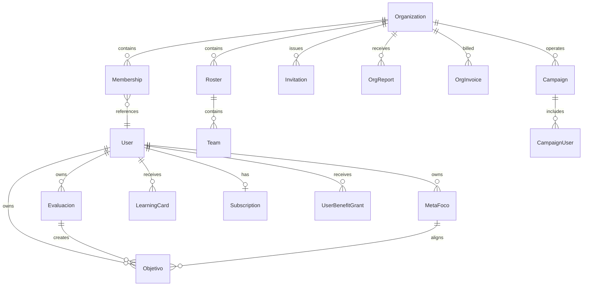

# Sentiq Database

Version: 1.0

Status: Current implementation

---

# Purpose

This document describes Sentiq's MongoDB persistence model, database boundaries, relationships, indexing and data conventions.

---

# Technology And Connections

Sentiq uses Mongoose with MongoDB.

Production operations are Atlas-oriented, but application connectivity is configured generically through environment URIs.

## Main Connection

Environment: `MONGO_URI`

Created through the default Mongoose connection in `sentiq-back/index.js`.

Contains global identity, athlete product, subscriptions, benefits and operational records.

## Organization Connection

Environment: `MONGO_ORG_URI`

Created with `mongoose.createConnection()` in `sentiq-back/db/connections.js`.

Contains organization structure, invitations, reports, billing, campaigns and org membership entitlements.

Local fallback: `mongodb://localhost:27017/sentiq-org`.

Both connections currently use `autoIndex: true`.

---

# Why Two Databases

The split isolates organization-scoped operational data from global athlete/product data.

Important consequence:

- Mongoose `ref` values across connections are documentation only unless models are explicitly coordinated.
- Standard `populate()` cannot resolve a `User` in main DB from a model registered on org DB.
- Cross-database joins happen in services/routes using stored ObjectIds.
- Cross-database writes are not one MongoDB transaction by default.

Commercial workflows such as campaigns therefore need idempotency, reservation and rollback logic.

---

# Main Database Models

## Identity And Athlete Profile

### User

Global identity and athlete profile.

Key data:

- Email/password hash
- Name/avatar/birth date
- Sport, role, country, language
- Plan and admin flags
- Followers/following
- Onboarding and legal acceptance
- Sports Mode, weekly schedule and notification preferences
- Push tokens
- Early-adopter and account deletion status

Important indexes:

- Case-insensitive unique email
- Text search over name/email
- Followers/following
- `lastActiveAt`, `isEarlyAdopter`, account status

### InvitacionSeguimiento

Red follow invitation between two User IDs.

States: pending, accepted, rejected.

---

# Athlete Development Models

## Evaluacion

Full and quick athlete evaluations.

Relationships:

- `userId` identifies owner (stored as String in this schema)
- `nuevosObjetivos[]` references Objetivo
- `evaluacionPrevios[]` embeds the reviewed objective snapshot/result

Timezone fields:

- `fecha` — UTC Date
- `tz` — IANA timezone at capture
- `diaLocal` — `YYYY-MM-DD`
- `mesLocal` — `YYYY-MM`

Important indexes:

- user/event/emotion/date
- user/event/date
- user/privacy/date
- unique `(userId, diaLocal)` — currently enforces one evaluation per local day
- user/local-month/date

The one-per-day unique rule is a current product constraint. Removing it requires an explicit product/data migration.

## Objetivo

Athlete objective.

Relationships:

- Owner User
- Created/evaluated Evaluacion
- Optional MetaFoco
- Optional suggesting User

Fields include category, priority, origin, active/result state, comment and declared Meta Foco alignment.

## MetaFoco

Medium-term athlete direction.

Contains title, description, horizon, success criteria, ambition, follower privacy and active/paused/closed state.

## InformeCoach

Generated Coach Sentiq report.

Stores language, sports-mode snapshot, mixed structured text, generation/period dates and resources.

## LearningCard

Weekly/monthly generated learning insight.

Contains:

- Type/category
- Text and generation context
- Meta Foco alignment
- User level
- Period and analyzed evaluation IDs
- Saved/seen/shared/notification state

Indexes:

- One card per user + period type + period start
- Common user/category/saved queries
- TTL on `expireAt`

Cards with `expireAt` are deleted by MongoDB after expiration; saved/shared cards should not carry that expiry.

## ObjectiveSuggestion

Legacy/limited suggestion model. It is not the primary persistence path for athlete AI objective suggestions.

---

# Premium, Benefits And Growth Models (Main DB)

## Subscription

One record per user for RevenueCat-backed subscription state.

Unique `userId`; includes platform, product, period type, status, expiration, purchase time and last webhook event.

## RcWebhookEvent

Unique RevenueCat event ID for webhook idempotency.

## BenefitDefinition

Catalog of non-commercial benefits.

Current type: Pro.

Defines duration and stack policy (`EXTEND_NON_COMMERCIAL_END`).

## UserBenefitGrant

Time-bounded benefit assigned to a user.

Sources:

- unlock program
- campaign
- admin
- promotion

Important constraints:

- globally unique idempotency key
- at most one active grant per user/source/sourceRef
- indexes for status/expiry and source lookup

## UserRewardProgress

One Unlock Pro progress record per user.

Tracks program stage, objective IDs, claims, completion and benefit end.

---

# Operations And Analytics Models (Main DB)

## NotificationDispatch

Deduplicates backend fallback reminders.

Unique key:

`userId + local event date + event type + stage`

## EmailLog

Best-effort Resend delivery/error log for infrastructure usage counts.

## ProductEvent

Generic progressive product-event catalog with source and properties.

This model exists, but the repository does not yet implement a comprehensive event tracking pipeline.

---

# Organization Database Models

## Organization

Organization identity, contact/profile data, limits/package configuration and billing configuration.

Billing currently supports manual/package/invoice-oriented state; Stripe is an allowed schema source but not the primary implemented flow.

## Membership

Connects a main-DB User ID to an Organization.

Roles:

- `player`
- `staff`
- `coach`
- `club_admin`

Statuses:

- active
- blocked
- ended

Unique `(orgId, userId)`.

`membershipWindows` preserve active periods and reactivation history for scoped analytics.

## Roster

Organization squad/container.

Stores coach, staff and player Membership IDs.

Unique name per organization.

## Team

Nested under a Roster.

Stores coach/staff/player Membership IDs.

Unique name per `(orgId, rosterId)`.

Legacy `members` remains for backward compatibility.

## Invitation

Organization invitation with:

- org/roster/team
- normalized email
- intended role
- hashed token and expiry
- reminders
- lifecycle state

Partial unique index prevents multiple active invitations for the same org/email/role.

## OrgReport

Generated organization report with type, source, scope, period, locale, content and status.

Indexes support org inbox, type/status and scheduled deduplication.

## OrgInvoice

Generated invoice with period, line items, totals and pending/paid/void state.

## EntitlementGrant

Organization-membership Pro grant.

At most one active grant per user + org + source.

Stores User/ObjectIds from main DB without cross-DB population.

## Campaign

Partner/event acquisition campaign.

Contains invite code, dates/status, benefit reference, capacity and used count.

Invite code is unique.

BenefitDefinition resides in main DB; org DB stores its ObjectId and code.

## CampaignUser

One user association per campaign.

Tracks capacity/result status and main-DB benefit grant ID.

Unique `(campaignId, userId)`.

---

# Relationship Map

The diagram is conceptual. User ↔ Membership and BenefitDefinition ↔ Campaign cross database boundaries.

---

# Time And Date Conventions

Athlete event data must preserve local calendar meaning.

Use:

- UTC Date for range queries
- IANA timezone for interpretation
- `diaLocal` / `mesLocal` for calendar grouping

Helpers in `utils/time.js` convert local dates and UTC ranges.

Do not derive the athlete's event day with naive UTC string slicing.

Schedules store weekday arrays of `HH:mm` plus schedule timezone.

---

# Data Integrity Patterns

- Unique indexes for email, one evaluation/day, subscription/user, campaign code, campaign membership and active grants
- Partial unique indexes for active invitations/grants
- Idempotency keys for benefit grants and RevenueCat events
- TTL for eligible Learning Cards
- Embedded snapshots for objective evaluation history
- Soft/lifecycle states rather than hard deletion for organizations, memberships, accounts and grants

---

# Privacy And Access

Database references do not grant access.

Backend must enforce:

- Athlete ownership
- Evaluation privacy in Red
- Follow relationship where required
- Membership and role for Org
- Roster/team scope
- Global admin/super-admin status

Sensitive fields:

- Password excluded by default from User queries
- Invitation tokens stored as hashes
- Runtime secrets stored in environment, not MongoDB documents

---

# Migrations And Indexes

There is no dedicated migration framework visible in package scripts.

`autoIndex: true` creates indexes from schemas at runtime.

Before production-scale schema changes:

1. Audit existing data.
2. Define backfill and rollback.
3. Create/change indexes deliberately.
4. Account for both connections.
5. Test partial failures in cross-db flows.

---

# Backup And Operations

Atlas integration provides usage/capacity metrics to the internal panel when configured.

Backup/restore policy is infrastructure configuration and is not fully encoded in this repository. It should be documented separately in operations/runbooks.

Never treat application-level soft deletion as a backup.

---

# Related Documents

- [architecture.md](./architecture.md)
- [backend.md](./backend.md)
- [mobile.md](./mobile.md)
